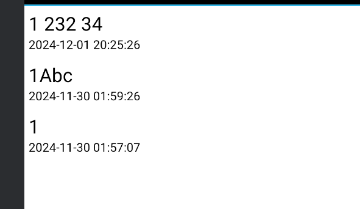
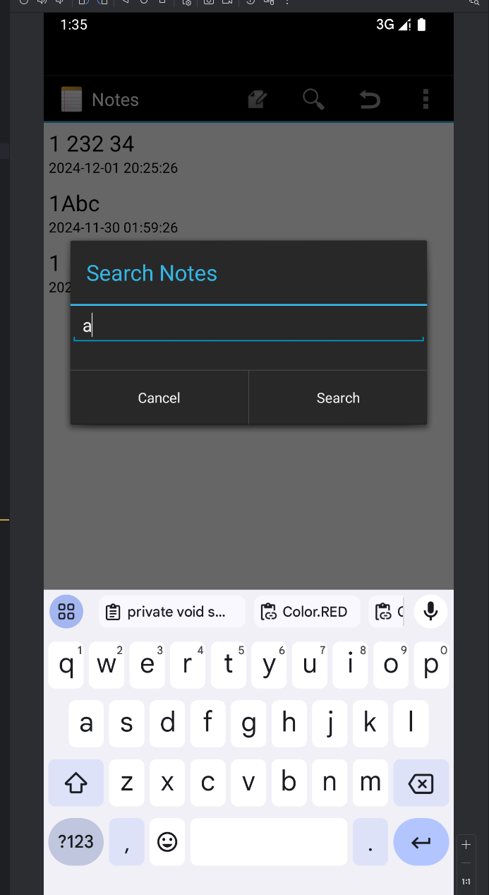
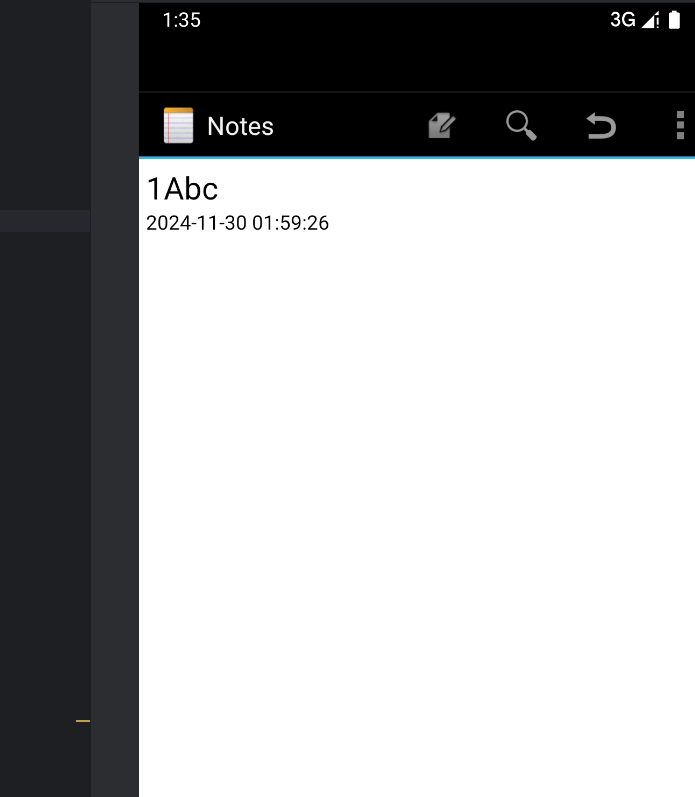
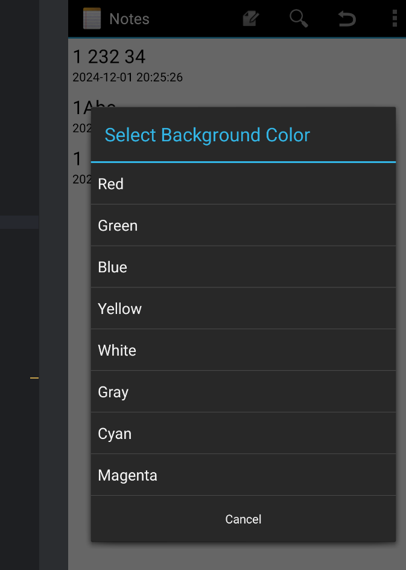
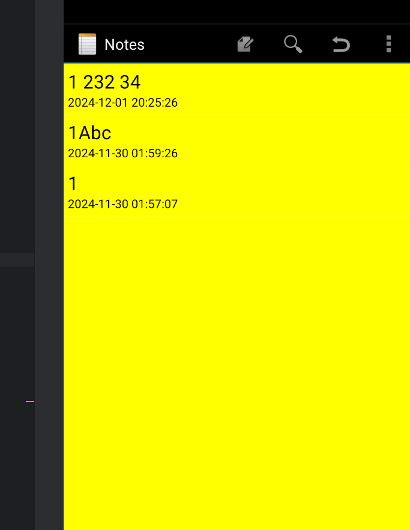
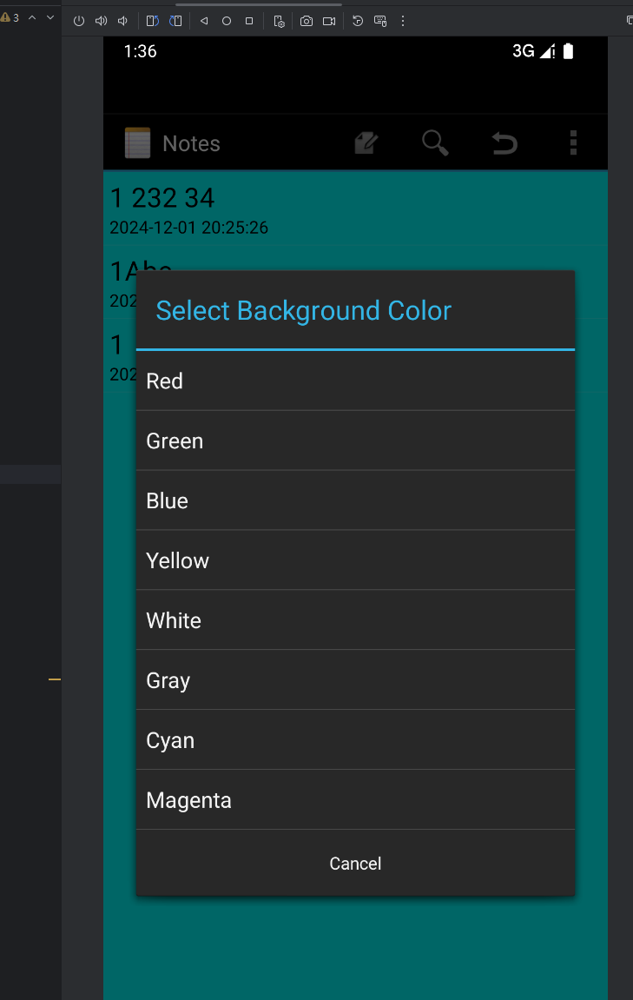
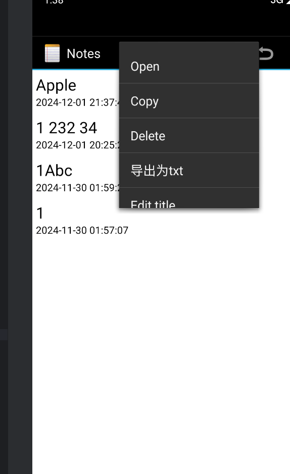
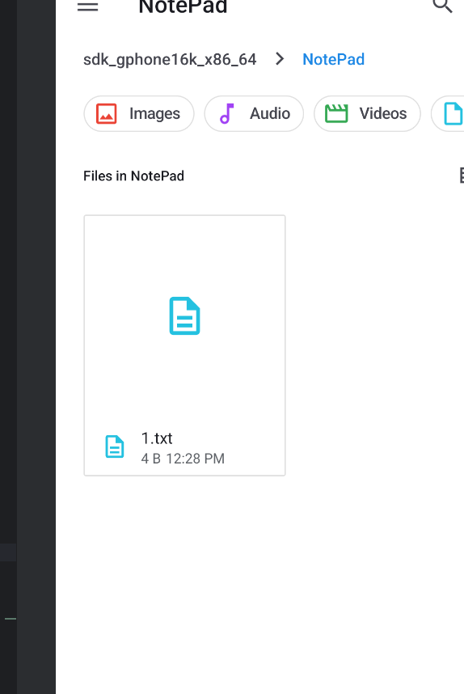

# NotePad笔记本应用

在原有的基础上添加了时间戳显示、搜索、背景换色、导出笔记等扩展功能。
 
 1.时间戳显示
   在笔记列表中显示笔记的修改时间，采用北京时间格式。

```
// 设置 ViewBinder 格式化时间戳
adapter.setViewBinder(new SimpleCursorAdapter.ViewBinder() {
@Override
public boolean setViewValue(View view, Cursor cursor, int columnIndex) {
if (view.getId() == R.id.text2) {
long timestamp = cursor.getLong(columnIndex);

                    // 设置为北京时间
                    java.text.SimpleDateFormat sdf = new java.text.SimpleDateFormat("yyyy-MM-dd HH:mm:ss", java.util.Locale.getDefault());
                    sdf.setTimeZone(java.util.TimeZone.getTimeZone("Asia/Shanghai"));

                    String formattedDate = sdf.format(new java.util.Date(timestamp));
                    ((TextView) view).setText(formattedDate);
                    return true;
                }
                return false;
            }
        });
   ```
   
  
   

2.笔记搜索功能
   支持通过标题和内容搜索笔记，实现了实时搜索功能。
```
private void showSearchDialog() {
        // 创建一个输入框
        final EditText input = new EditText(this);
        input.setHint("Enter search query");

        // 使用 android.app.AlertDialog 创建对话框
        new android.app.AlertDialog.Builder(this)
                .setTitle("Search Notes")
                .setView(input)
                .setPositiveButton("Search", (dialog, which) -> {
                    String query = input.getText().toString().trim(); // 获取输入的查询关键字

                    // 检查输入是为空
                    if (query.isEmpty()) {
                        Toast.makeText(this, "Search query cannot be empty", Toast.LENGTH_SHORT).show();
                        return;
                    }

                    // 使用 rawQuery 执行查询
                    String selection = NotePad.Notes.COLUMN_NAME_TITLE + " LIKE ? OR " +
                            NotePad.Notes.COLUMN_NAME_NOTE + " LIKE ?";

                    // 参数绑定
                    String[] selectionArgs = new String[]{"%" + query + "%", "%" + query + "%"};

                    // 查询数据库
                    Cursor cursor = getContentResolver().query(
                            NotePad.Notes.CONTENT_URI,       // 查询的 URI
                            PROJECTION,                      // 查询的列
                            selection,                       // 查询条件
                            selectionArgs,                   // 查询参数
                            NotePad.Notes.DEFAULT_SORT_ORDER // 排序
                    );

                    if (cursor != null && cursor.getCount() > 0) {
                        // 新列表视图
                        ((SimpleCursorAdapter) getListAdapter()).changeCursor(cursor);
                    } else {
                        Toast.makeText(this, "No notes found", Toast.LENGTH_SHORT).show();
                    }
                })
                .setNegativeButton("Cancel", (dialog, which) -> dialog.dismiss())
                .show();
    }
   ```
   
   
   
   
   
   


3.提供多种预设颜色供用户选择，支持持久化保存颜色设置。
  在菜单栏右上角三的点的拓展菜单中选择Change Background Color
   可选颜色：
   红色
   绿色
   蓝色
   黄色
   白色
   灰色
   青色
   品红色
```
private void showColorPicker() {
        // 定义预设颜色及名称（移除黑色背景颜色）
        final int[] colors = {
                Color.RED, Color.GREEN, Color.BLUE, Color.YELLOW,
                Color.WHITE, Color.GRAY, Color.CYAN, Color.MAGENTA
        };

        final String[] colorNames = {
                "Red", "Green", "Blue", "Yellow",
                "White", "Gray", "Cyan", "Magenta"
        };

        // 创建一个简单的 ListView 作为选择界面
        ListView listView = new ListView(this);
        ArrayAdapter<String> adapter = new ArrayAdapter<>(this, android.R.layout.simple_list_item_1, colorNames);
        listView.setAdapter(adapter);

        // 设置点击事件来改变背景颜色
        listView.setOnItemClickListener((parent, view, position, id) -> {
            int selectedColor = colors[position];

            // 更改背景颜色
            View rootView = findViewById(android.R.id.content);
            rootView.setBackgroundColor(selectedColor);

            // 保存用户选择的颜色到 SharedPreferences
            SharedPreferences sharedPreferences = getSharedPreferences("Settings", MODE_PRIVATE);
            SharedPreferences.Editor editor = sharedPreferences.edit();
            editor.putInt("background_color", selectedColor);
            editor.apply();

            // 提示用户已更改
            Toast.makeText(this, "Background color changed to " + colorNames[position], Toast.LENGTH_SHORT).show();
        });

        // 创建一个 AlertDialog 展示列表
        AlertDialog.Builder builder = new AlertDialog.Builder(this);
        builder.setTitle("Select Background Color")
                .setView(listView)
                .setNegativeButton("Cancel", (dialog, which) -> dialog.dismiss())
                .show();
    }

```  

   
   
   
   
   
   
   
   
 4.导出笔记功能
      支持将笔记导出为txt文本文件，保存到设备存储。
      功能特点：
      长按目标笔记，选择导出为txt
      导出文件名为笔记标题
      自动创建NotePad文件夹
      导出内容包含标题和正文
      导出成功显示文件路径
      支持特殊字符处理
      
```
private void exportNote(long noteId) {
        Uri noteUri = ContentUris.withAppendedId(getIntent().getData(), noteId);
        Cursor cursor = getContentResolver().query(
            noteUri,
            new String[] { NotePad.Notes.COLUMN_NAME_TITLE, NotePad.Notes.COLUMN_NAME_NOTE },
            null,
            null,
            null
        );

        if (cursor != null && cursor.moveToFirst()) {
            String title = cursor.getString(cursor.getColumnIndex(NotePad.Notes.COLUMN_NAME_TITLE));
            String content = cursor.getString(cursor.getColumnIndex(NotePad.Notes.COLUMN_NAME_NOTE));
            cursor.close();

            try {
                // 获取外部存储目录
                File notesFolder = new File(Environment.getExternalStorageDirectory(), "NotePad");
                if (!notesFolder.exists()) {
                    notesFolder.mkdirs();
                }

                // 创建文件
                String fileName = title.replaceAll("[\\\\/:*?\"<>|]", "_") + ".txt";
                File file = new File(notesFolder, fileName);

                // 写入内容
                FileWriter writer = new FileWriter(file);
                writer.write(title + "\n\n");
                writer.write(content);
                writer.close();

                Toast.makeText(this, "已导出到: " + file.getAbsolutePath(), Toast.LENGTH_LONG).show();
            } catch (IOException e) {
                Toast.makeText(this, "导出失败: " + e.getMessage(), Toast.LENGTH_SHORT).show();
                e.printStackTrace();
            }
        }
    }
  ```
   
    
    
      
 
 
      

#    **使用说明**

1.  启动应用
2.  点击"+"添加新笔记
3.  长按笔记可以进行编辑、复制、删除、导出操作 
4.  点击菜单可以进行搜索、更换背景色等操作